<p align="center">
  <a href="https://ant.design">
    
  </a>
</p>

<h1 align="center">🎵🎵React Music</h1>

<div align="center">

<h2>React类组件构建的ReactAPP</h2>


[npm-image]: http://img.shields.io/npm/v/antd.svg?style=flat-square
</div>

## 📷 Photo
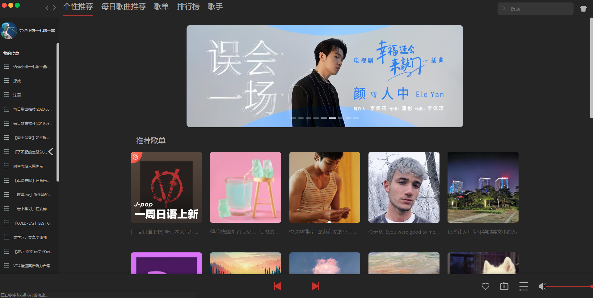
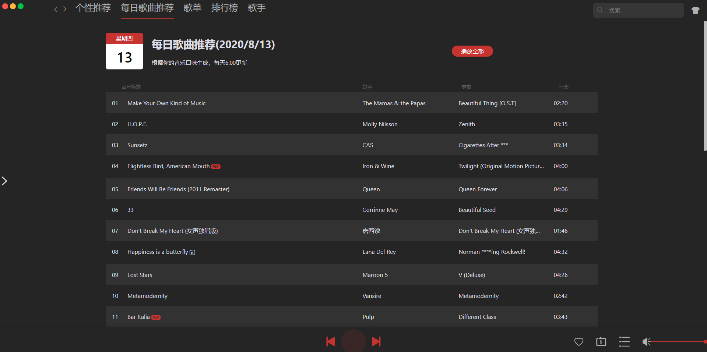
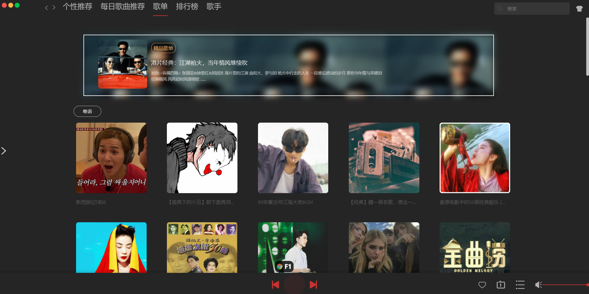

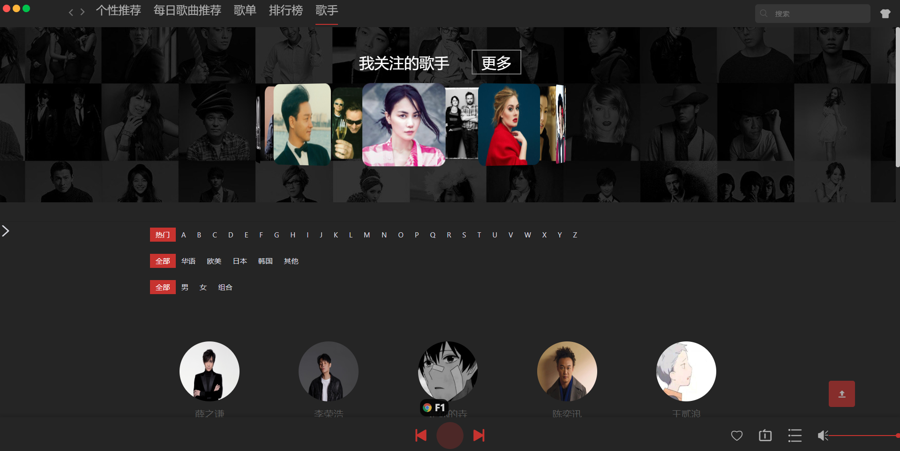
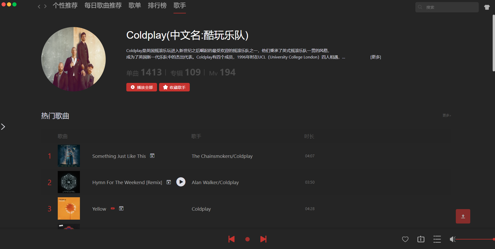
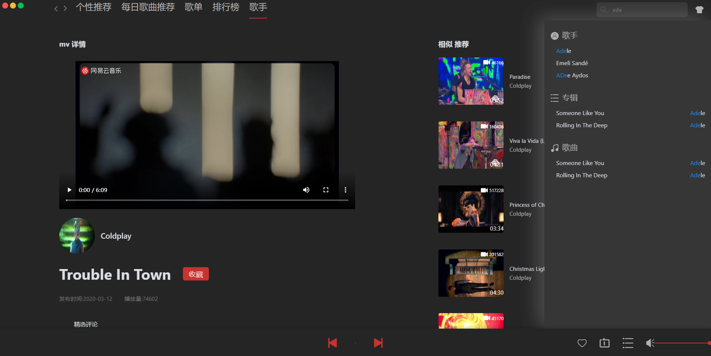
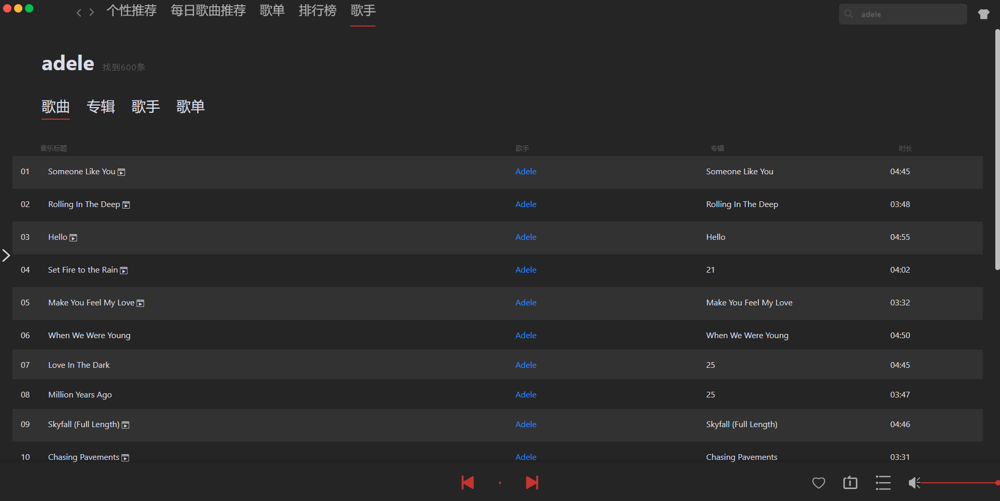
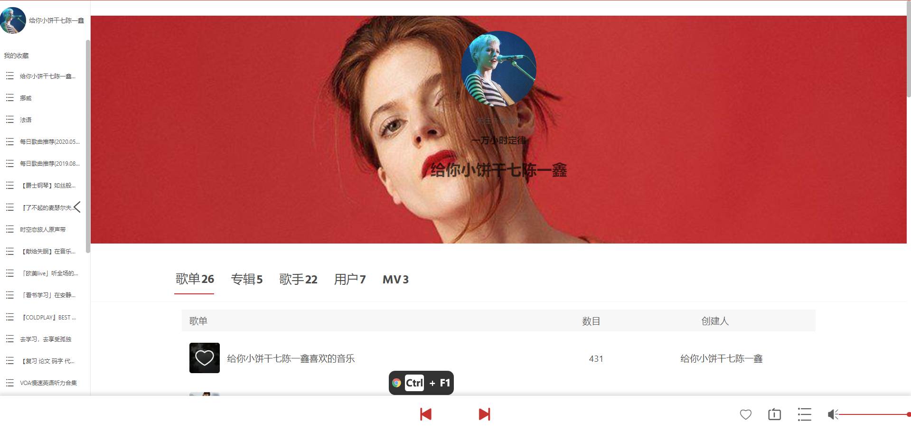
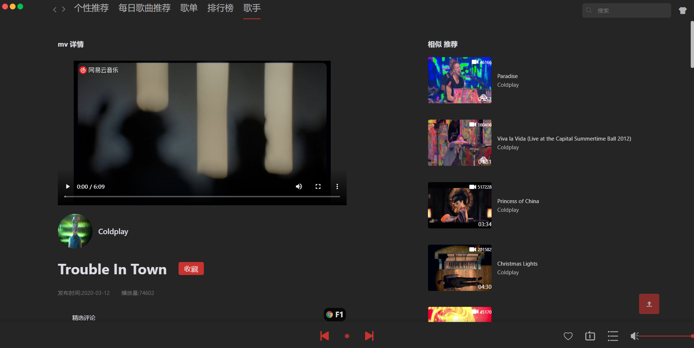
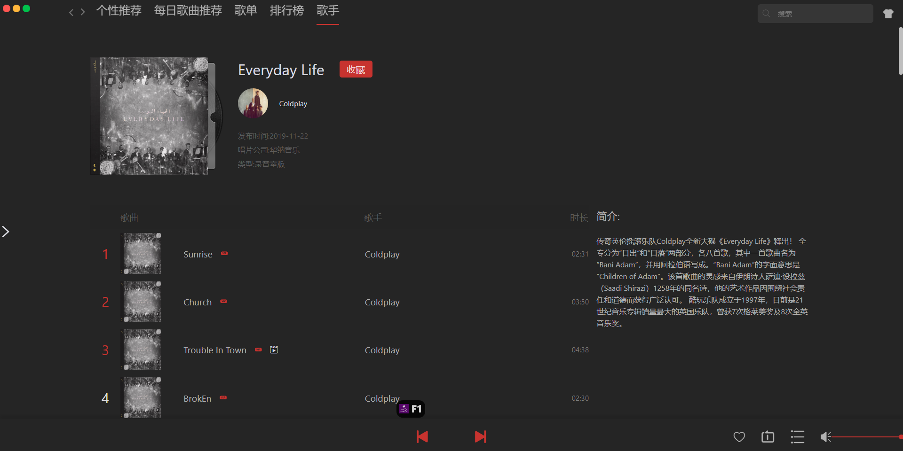
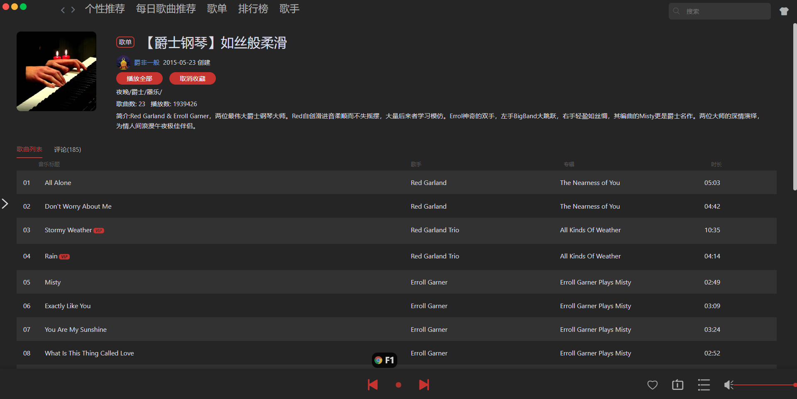
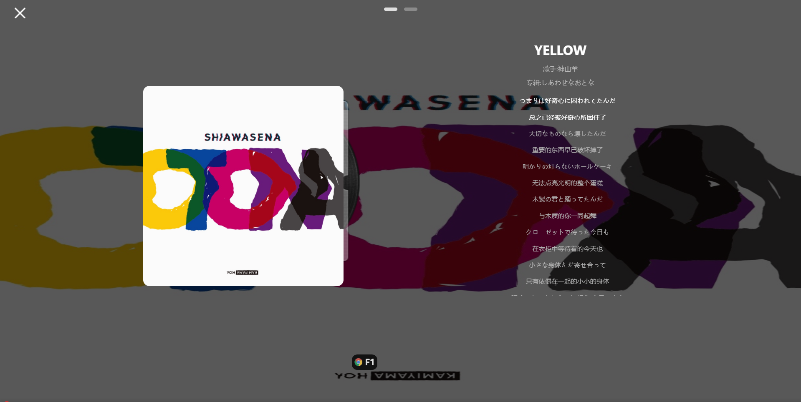
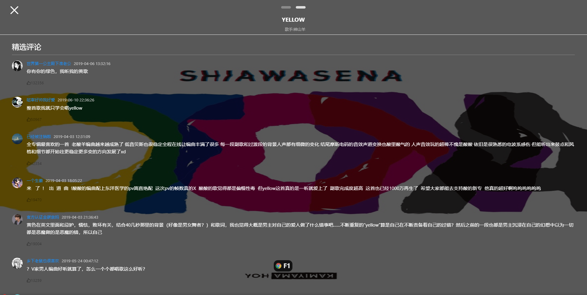

## 😘 支持库
- 🍇 React 全家桶
- 🎨 antd 用过就知道爽
- 🛴 immutable 管理Redux数据
- 🍎 autoprefixer 打包带前缀
- 🛠 prettier 代码规范
- 👍 publish.js 事件派发
- 🌈 sass css 预处理语言
- 🎄 js-cookie 管理Cookie
- ✈ better-scroll 歌词滚动(这库超强)
- 🤣 classnames 三目运算符再见
- 💍 web-storage-cache 管理localStorage

## ✈ 已完成功能
- [x] 手机号码登录
- [x] 播放
- [x] 点赞收藏
- [x] 喜欢歌曲 收藏歌单
- [x] 收藏歌单
- [x] 个性推荐
- [x] 每日推荐
- [x] 歌单列表
- [x] 排行榜
- [x] 歌手筛选
- [x] 歌手详情页
- [x] 专辑页
- [x] MV播放
- [x] 分享
- [x] 搜索 搜索页面
- [x] 用户页面
- [x] 换肤

## ❌ Todo
- [ ] 歌曲定位
- [ ] 歌单内搜索歌词
- [ ] 性能优化
- [ ] 错误边界
- [ ] hooks重构部分组件

## 🐛 Bug
- ❌ 谷歌浏览器最小字体12px限制 导致缩小一定范围内容样式异常 点击progress-bar出现异常
- ❌ Edge 点击progress-bar点击无反应
- ❌ 点击历史记录再点击搜索框出现加载中message
- ❌ 线上每日推荐获取偶尔301 需要先登录再点击才有数据

## 🖥 运行环境

首选Chrome FF 部分浏览器无法进去浏览地址 
手机端点击全屏再横屏效果更佳 

## 🚀 后台数据
[NeteaseCloudMusicApi](https://github.com/Binaryify/NeteaseCloudMusicApi)

## 🎉 预览地址
[Ethan](http://193.112.175.198/Ethan/#/)

## 📦 运行

```bash
npm install 
```

```bash
npm run start
```

## 🔈 说明
1.clone到本地后,使用自己的node后台,修改[request.js](https://github.com/chenmingzhen/react-music/blob/master/src/api/request.js)的默认url,修改分享的Url[Shared](https://github.com/chenmingzhen/react-music/blob/master/src/assets/js/constants.js)

2.本项目默认使用Hash模式，若想去掉丑陋的#，请修改Route的Path ，push要带上Nginx或Tomcat或其他配置的地址 ，如果有需要 issue联系

3.😜😜欢迎clone与提出改善意见

4.❗❗本项目用于学习！绝不可用于违犯 使用盗版链接❗❗


